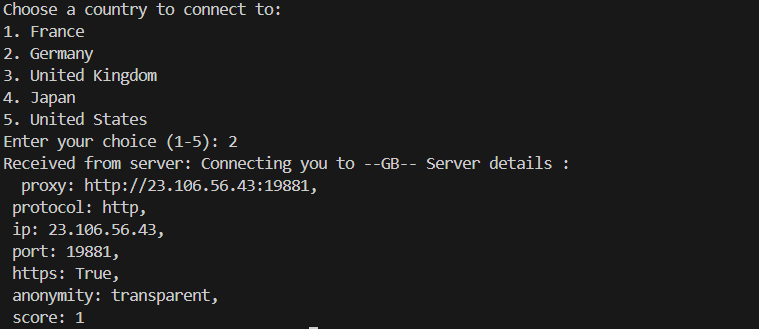
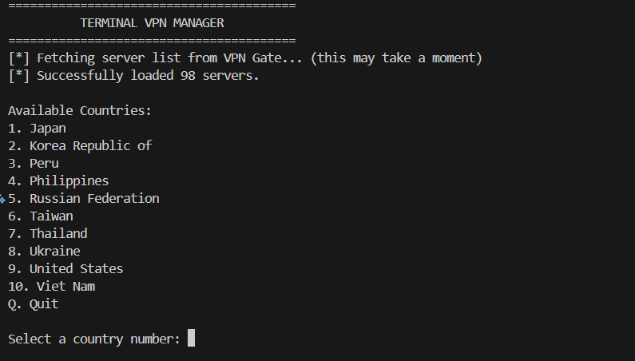

# CLI VPN Python App

A learning-focused VPN project implemented in Python with a command-line interface.

It includes:
- A TLS-secured local client/server flow
- Certificate/key generation scripts
- A management CLI for setup and server lifecycle
- An optional "open server" mode that fetches VPN Gate endpoints and runs OpenVPN

## Core Functionalities

### 1. Secure local VPN-like connection (TLS socket)
- `local_server/vpn_server.py` starts an SSL/TLS socket server.
- `local_server/vpn_client.py` connects securely and selects a country.
- The server picks a matching endpoint from local data and returns connection details.
- Client can send `DISCONNECT` to close the session.

### 2. Certificate lifecycle management
- `local_server/key.py` supports:
  - `generate` (private key + CSR + self-signed certificate)
  - `check` (validity/expiry check)
  - `info` (full cert details)
  - `cleanup` (remove generated cert artifacts)
- Uses OpenSSL via shell commands.

### 3. Server management CLI
- `local_server/manage.py` supports:
  - `setup` (creates directories and ensures certs)
  - `start`, `stop`, `restart`
  - `status`
  - `certs`
  - `logs` (placeholder)
  - `help`

### 4. Open server mode (VPN Gate + OpenVPN)
- `open_source/vpn_api.py` fetches and parses VPN Gate server data.
- `open_source/app.py` provides an interactive country/server picker.
- `open_source/vpn_core.py` decodes OpenVPN config and launches `openvpn`.

### 5. Combined app mode (service selector + DB auth)
- `app_running_server/server.py` + `app_running_server/client.py`
- Adds:
  - User authentication through MySQL
  - Service selection:
    - `LOCAL HOSTING`
    - `OPEN SERVER`

## Project Structure

```text
vpn_server/
  keys_and_certification/
    server.csr
    server.csr.cnf
    server.crt.cnf
  python_scripts/
    app_running_server/
      client.py
      server.py
    local_server/
      data.py
      key.py
      manage.py
      server.crt
      server.key
      vpn_client.py
      vpn_server.py
    open_source/
      app.py
      vpn_api.py
      vpn_core.py
```

## Requirements

- Python 3.9+
- OpenSSL installed and available in `PATH`
- (Open server mode) OpenVPN installed and available in `PATH`
- (Combined app mode) MySQL server + Python DB connector

Install Python packages:

```bash
pip install -r requirements.txt
pip install mysql-connector-python python-dotenv
```

## Quick Start (Local Server Mode)



From project root:

```bash
cd vpn_server/python_scripts/local_server
python manage.py setup
python key.py generate
python manage.py start
```

In a second terminal:

```bash
cd vpn_server/python_scripts/local_server
python vpn_client.py
```

Useful management commands:

```bash
python manage.py status
python manage.py restart
python manage.py stop
python key.py check
python key.py info
```

## Open Server Mode (Standalone)



From:

```bash
cd vpn_server/python_scripts/open_source
python app.py
```

What this does:
- Downloads VPN Gate list
- Lets you choose a country
- Shows top servers (speed/ping)
- Starts OpenVPN with decoded config

## Combined App Mode (DB + Service Choice)

From:

```bash
cd vpn_server/python_scripts
python app_running_server/server.py
```

In another terminal:

```bash
cd vpn_server/python_scripts
python app_running_server/client.py
```

Create a `.env` file (or export env vars) for DB connectivity:

```env
DB_HOST=127.0.0.1
DB_PORT=3306
DB_NAME=your_database_name
DB_USER=your_username
DB_PASS=your_password
```

Expected DB tables used by current code:
- `services`
- `countries`
- `users`

## Notes and Limitations

- This is an educational project and not production-ready VPN infrastructure.
- `manage.py logs` is currently a placeholder.
- Some flows assume files are run from specific working directories.
- The local mode returns server/proxy details; it does not create a full OS-level tunnel by itself.

## Team

- Djedi Fahd
- Angar Yacine
- Djebbar Seddik Adel
- Banazza Mehdi
